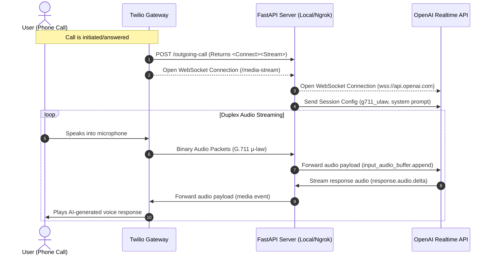
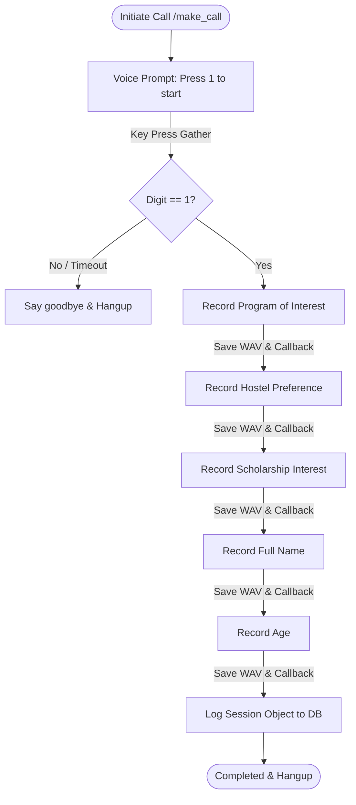

# 📞 AI-Powered IVR Calling & Voice Streaming System

An advanced, enterprise-grade telephony platform featuring a **hybrid architecture** that combines a **Real-Time Conversational AI Voice Agent** (FastAPI + WebSockets + OpenAI Realtime API) with a structured **Interactive Voice Response (IVR) Data Collector** (Flask + Twilio Voice).

This system allows businesses to either engage customers in sub-second latency, human-like voice conversations, or conduct highly structured automated phone surveys with local recording extraction.

---

## 🏗️ System Architecture

### ⚡ 1. Real-Time AI Voice Streaming (FastAPI + WebSockets)
This flow leverages bi-directional WebSockets to stream microphone and telephony audio directly between the phone call (Twilio) and OpenAI's GPT-4o Realtime API, achieving sub-second latency with natural voice interruptions.



### 📋 2. Traditional Structured IVR Collector (Flask)
This flow is a deterministic survey collector that prompts the user step-by-step using Twilio's `<Gather>` and `<Record>` elements, downloads raw audio files, and maintains session states.



---

## 🌟 Core Features

| Feature | Real-Time Voice Agent (`api.py`) | Structured IVR Collector (`call_app.py`) |
| :--- | :--- | :--- |
| **Framework** | FastAPI (`asyncio` + `aiohttp`) | Flask (Synchronous WSGI) |
| **AI Model** | OpenAI Real-Time API (`gpt-4o-realtime`) | Deterministic Rule-Based TwiML |
| **Latency** | Sub-second (~300ms, human-like) | N/A (Standard menu-response) |
| **Communication Channel** | Bi-directional WebSockets (`wss://`) | HTTP Webhooks / XML (TwiML) |
| **Data Handling** | Live audio duplex streaming | Local `.wav` download to storage |
| **Key Use Cases** | Customer Support, Live Sales, Conversational Agents | Admissions Surveys, Data Entry, Automated Forms |

---

## 🛠️ Tech Stack & Dependencies

- **Telephony Infrastructure:** Twilio Voice API (TwiML, Media Streams, REST Client)
- **Real-Time WebSocket Server:** FastAPI, Uvicorn, WebSockets, `aiohttp`, `asyncio`
- **Data Capture Webhook Server:** Flask, Requests (with HTTPBasicAuth)
- **AI Core:** OpenAI Realtime Gateway API (`wss://api.openai.com/v1/realtime`)
- **Environment Management:** Python-dotenv, OS Path management

---

## 🚀 Setup & Installation

### 1. Clone & Install Dependencies
```bash
git clone https://github.com/RockybhaiRakesh/AI_IVR_calling.git
cd AI_IVR_calling
pip install fastapi uvicorn websockets aiohttp requests Flask twilio python-dotenv
```

### 2. Configure Environment Variables
Create a `.env` file in the root directory:
```env
TWILIO_ACCOUNT_SID=your_twilio_account_sid
TWILIO_AUTH_TOKEN=your_twilio_auth_token
TWILIO_PHONE_NUMBER=your_twilio_phone_number
OPENAI_API_KEY=your_openai_api_key
NGROK_URL=https://your-ngrok-subdomain.ngrok-free.app
PORT=5000
```

### 3. Expose Your Local Server
Twilio requires a public URL to send webhooks. Use Ngrok to expose your local port:
```bash
ngrok http 5000
```
*Copy the generated HTTPS URL and paste it as `NGROK_URL` in your `.env`.*

---

## 🖥️ Running the Services

### Option A: Running the OpenAI Real-Time Voice Agent (FastAPI)
Run the asynchronous real-time server using Uvicorn:
```bash
python api.py
```
This boots up the FastAPI server on `http://0.0.0.0:5000`.

#### API Endpoints (FastAPI):
1. **Trigger Outgoing AI Call:**
   - **Method:** `POST /make-call`
   - **Payload:** `{"to": "+91XXXXXXXXXX"}`
   - **Description:** Triggers Twilio to dial the destination and connect the media stream.
2. **WebSocket Stream Endpoint:**
   - **URI:** `ws://<your-ngrok-url>/media-stream`
   - **Description:** Handles real-time multiplexed binary audio payloads (G.711 μ-law) between Twilio and OpenAI.

---

### Option B: Running the Structured Survey Collector (Flask)
Run the synchronous Flask app:
```bash
python call_app.py
```

#### API Endpoints (Flask):
1. **Trigger Outbound Survey Call:**
   - **Method:** `GET /make_call?to=+91XXXXXXXXXX`
2. **TwiML Entrypoint:**
   - **Method:** `POST /voice` (Answers call and plays the greeting menu).
3. **Key Press Receiver:**
   - **Method:** `POST /gather_input` (Validates user input to begin recording).
4. **Recording Extractor Webhook:**
   - **Method:** `POST /save_response?field=<field_name>` (Pulls raw audio from Twilio's CDN and saves it locally in `.wav` format).

---

## 📂 File Extraction & Data Storage (Flask Flow)
Every voice response is fetched from Twilio's media servers and cached locally in a folder named `recordings/`.

**Example Saved Files:**
- `recordings/CAxxxxxx_program.wav`
- `recordings/CAxxxxxx_hostel.wav`
- `recordings/CAxxxxxx_scholarship.wav`
- `recordings/CAxxxxxx_name.wav`
- `recordings/CAxxxxxx_age.wav`

The system records a dictionary mapping each field to its local filepath:
```json
{
  "program_recording_local": "C:\\Users\\...\\recordings\\CAxxx_program.wav",
  "hostel_recording_local": "C:\\Users\\...\\recordings\\CAxxx_hostel.wav",
  "scholarship_recording_local": "C:\\Users\\...\\recordings\\CAxxx_scholarship.wav",
  "name_recording_local": "C:\\Users\\...\\recordings\\CAxxx_name.wav",
  "age_recording_local": "C:\\Users\\...\\recordings\\CAxxx_age.wav",
  "collected_at": "2026-07-16T19:00:00Z"
}
```

---

## 🔒 Security & Optimization Notes
- **Local Cache Expiry:** Audio recordings are stored locally; ensure your script runs in a secure sandbox with proper file access controls.
- **WebSocket Reconnection:** In production, add a retry handler to reconnect websockets if network drops happen.
- **Billing Warning:** Real-time OpenAI API calls charge per token (input, output, and audio cache). Consider using voice activity detection (VAD) thresholds.
